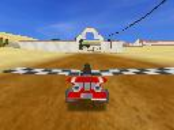
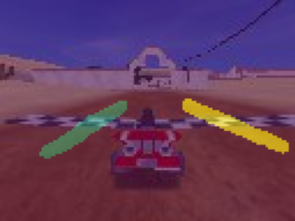
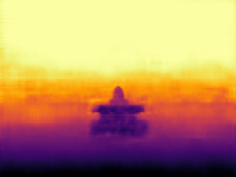

# Multitask Road Vision

A single CNN that looks at one racing-kart camera frame and answers two
questions per pixel: **what is this** (road / left boundary / right
boundary) and **how far away is it**. Built on top of a model from UT
Austin's Deep Learning coursework, then extended into an interactive
site with a 3D reconstruction, a real failure-case gallery, and an honest
class-imbalance experiment.

**Live demo:** [multitask-road-vision-3d.vercel.app](https://multitask-road-vision-3d.vercel.app/)

<p align="left">
  
  
  
</p>

## Features

- **Scene explorer** — switch between RGB / Segmentation / Depth / 3D on
  the same frame, with a live per-pixel inspector (class + depth on hover)
- **3D reconstruction** — depth + segmentation pushed into an interactive
  point cloud (react-three-fiber), colorable by RGB / semantic class /
  depth, filterable per class
- **Failure gallery** — the three actual worst-IoU frames from the full
  validation split, not cherry-picked examples
- **Class-imbalance experiment** — trained the same model with and
  without weighted `CrossEntropyLoss`, at a matched 20-epoch budget, and
  reported what actually happened (see [Results](#results))
- **Real performance numbers** — inference latency and parameter counts
  measured on the hardware this was built on, not borrowed GPU benchmarks

## Architecture

```
RGB (3×96×128) → Shared Encoder (down1 → down2 → down3, 3 → 64ch)
                       ├─→ Segmentation Head → per-pixel class (3)
                       └─→ Depth Head        → per-pixel distance
```

Both heads reuse encoder skip connections (U-Net style) to recover
spatial detail lost while downsampling. Trained jointly on:

```
L_total = L_seg + λ · L_depth        (λ = 1)
L_seg   = CrossEntropyLoss(weight=[1, 10, 10])
L_depth = MSELoss
```

`L_seg` and `L_depth` sit on very different scales (bounded
log-probabilities vs. squared pixel error) and are summed with no
explicit normalization — a shortcut that works here but wouldn't scale
to loss terms of wildly different magnitude.

## Results

The training data is heavily imbalanced — measured over the full
validation split (2,000 frames, ~24.6M pixels):

| Class          | % of pixels |
| -------------- | ----------- |
| Road           | 97.19%      |
| Left Boundary  | 1.42%       |
| Right Boundary | 1.39%       |

Trained two models from scratch, identical setup, 20 epochs each, only
`class_weights` different:

| Class          | Weighted `[1,10,10]` | Unweighted |
| -------------- | --------------------- | ---------- |
| Road           | 0.974                 | **0.985**  |
| Left Boundary  | 0.525                 | **0.580**  |
| Right Boundary | 0.508                 | **0.574**  |

At a matched epoch budget, the unweighted model actually finished
slightly ahead on every class. The convergence curves explain why: the
weighted model reaches IoU ≈0.47 in epoch 1, while the unweighted model
is stuck near 0.33 (predicting background only) for its first ~7 epochs
before catching up and overtaking. **The weights bought a faster, safer
start, not a higher final ceiling** — at least at this scale, and with
one seed per condition, so the late-game crossover isn't fully confirmed
to be a real effect rather than noise.

## Performance

Measured locally (forward pass only, batch size 1):

| Metric              | Value                                  |
| -------------------- | --------------------------------------- |
| Latency               | 0.87 ms/frame (≈1,150 FPS)              |
| Device                 | Apple M5 Pro (MPS)                      |
| Params (multitask)     | 142.8K                                  |
| Params (2 separate models) | ~215.3K                             |
| Savings from sharing one encoder | 33.7% fewer parameters      |

## Tech stack

- **`ml/`** — PyTorch, NumPy, OpenCV, torchvision
- **`web/`** — Next.js, TypeScript, Tailwind CSS, react-three-fiber /
  drei / three.js, Recharts

## Project structure

```
ml/                     model, training, evaluation (PyTorch)
  models.py             Detector: shared encoder + seg/depth heads
  train_with_weights.py / train_no_weights.py
  explore.ipynb          layer-by-layer exploration notebook
  eval_compare.py         per-class IoU comparison
web/                     Next.js portfolio site
  app/components/         SceneExplorer, PointCloud, Architecture, ...
  public/data/             exported model outputs consumed by the site
.github/workflows/       CI (lint, typecheck, build)
```

## Running locally

**`ml/`** (Python 3.12, PyTorch)

```bash
cd ml
python3 -m venv venv && source venv/bin/activate
pip install -r requirements.txt
jupyter notebook explore.ipynb
```

**`web/`** (Node 20+)

```bash
cd web
npm install
npm run dev
```

## Data

[SuperTuxKart Drive Dataset](https://www.cs.utexas.edu/~bzhou/dl_class/drive_data.zip),
via UT Austin's Deep Learning course.

## Author

Jiyoung Yoon
